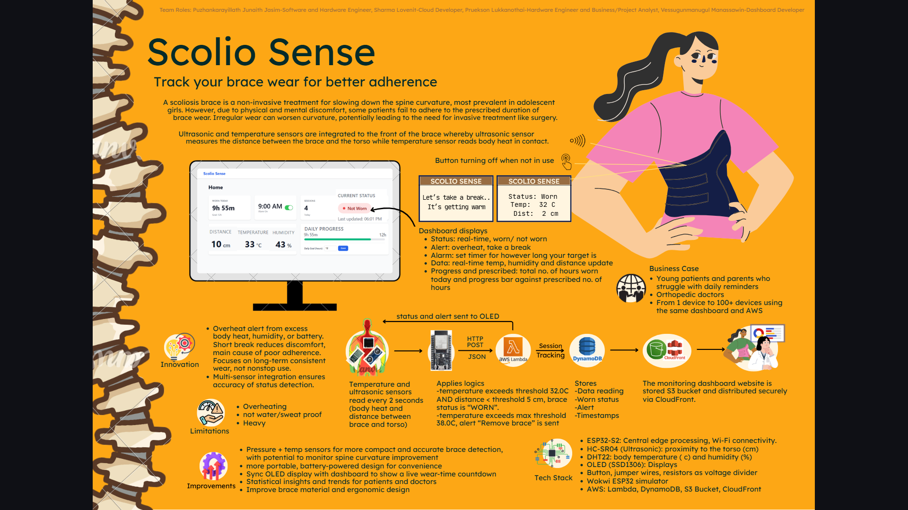

# Scolio-Sense

This project implements a smart tracking system for scoliosis brace wear using HC-SR04 and DHT22 sensors. The ultrasonic sensor detects when the brace is put on or taken off, while the temperature sensor verifies that the brace is in contact with the patient’s body, ensuring accurate wear detection. The system logs daily start and end times, calculates total hours of wear, and provides doctors with reliable data to assess treatment accordingly.

## Tech Stack

- **Hardware**
  - HC-SR04 ultrasonic distance sensor
  - DHT22 temperature/humidity sensor
  - Microcontroller board (Arduino-compatible / ESP-based)
  - Power supply and brace mounting hardware

- **Software**
  - C/C++ firmware for the microcontroller (Arduino-style toolchain)
  - Basic data logging and time tracking logic

## Features

- **Smart brace detection**: Combines ultrasonic distance and skin-contact temperature readings to decide when the brace is actually worn.
- **Wear-time tracking**: Logs start and end times and calculates total daily brace wear duration.
- **Doctor-friendly data**: Provides reliable data to help clinicians assess treatment adherence and outcomes.
- **Patient adherence support**: Helps encourage patients to follow prescribed brace-wear regimens.

## Setup Instructions

- **1. Clone the repository**
  - Download or clone this project into your development environment.

- **2. Configure credentials (if applicable)**
  - Use `cred_example.h` as a template and create/update `cred.h` with your own credentials (e.g., Wi-Fi or API keys if used in your setup).

- **3. Open the firmware**
  - Open the main firmware source file (e.g., `.ino` or `.cpp`) in the Arduino IDE or your preferred embedded toolchain.

- **4. Select board and port**
  - In your IDE, select the correct board type that matches your microcontroller and choose the appropriate serial port.

- **5. Upload to device**
  - Compile and upload the firmware to the microcontroller.
  - Connect the sensors according to your hardware wiring diagram and power the system.

## Usage

- **Brace wear tracking**
  - When the patient puts on the brace, the ultrasonic sensor and temperature sensor together detect a valid "brace on" state and start counting wear time.
  - When the brace is removed, the system records an "off" event and stops the timer.

- **Reviewing data**
  - Use your preferred method (serial monitor, on-device logs, or any connected interface you add) to inspect daily wear durations.
  - Share or export the data for clinical review as required.

## Screenshots / Video Demo

- **System overview image**
  - 

- **Video demo (optional)**
  - Add a link to your demo video here once available.

## File Structure

- **README.md**: Project overview and documentation (this file).
- **cred_example.h**: Example credentials header to copy and customize.
- **cred.h**: User-specific credentials (not committed or shared publicly).
- **image.png**: Illustration or overview image of the Scolio-Sense setup.
- **Firmware source files**: Main microcontroller code (`.ino` / `.cpp` / `.h`) implementing sensor reading and wear-time logic.

## Enhancement Roadmap

- **Data visualization dashboard**: Web or mobile app to visualize daily/weekly brace wear patterns.
- **Cloud integration**: Securely upload wear-time data to a remote server for clinician access.
- **Calibration tools**: Simple UI or routine to calibrate ultrasonic distance thresholds and temperature limits per patient.
- **On-device alerts**: Add vibration/buzzer or LED indicators to nudge patients about insufficient wear time.
- **Power optimization**: Improve sleep modes and sensor duty-cycling to extend battery life.

## Contribution

- **Issues and ideas**
  - Open an issue to report bugs, propose new features, or discuss design improvements.

- **Pull requests**
  - Fork the repository, create a feature branch, and submit a pull request with a clear description of your changes.
  - Please keep changes focused and well-documented.

## Important Note

This project is intended as a **supportive tracking tool** and **must not** replace professional medical advice, diagnosis, or treatment. Always consult qualified healthcare professionals for decisions regarding scoliosis treatment, and validate this system in a controlled setting before relying on it clinically. Be aware that sensor heating, sweat, and mounting conditions can affect comfort, durability, and accuracy.

## License

Specify your chosen license here (e.g., MIT, Apache 2.0) and add the corresponding `LICENSE` file to the repository.

## References

- **HC-SR04 ultrasonic sensor**: Typical datasheets and tutorials (e.g., on [Arduino documentation](https://docs.arduino.cc/) or similar resources).
- **DHT22 temperature/humidity sensor**: Manufacturer datasheet and usage guides.
- **Scoliosis brace adherence literature**: Add links to any academic or clinical papers you base this project on.